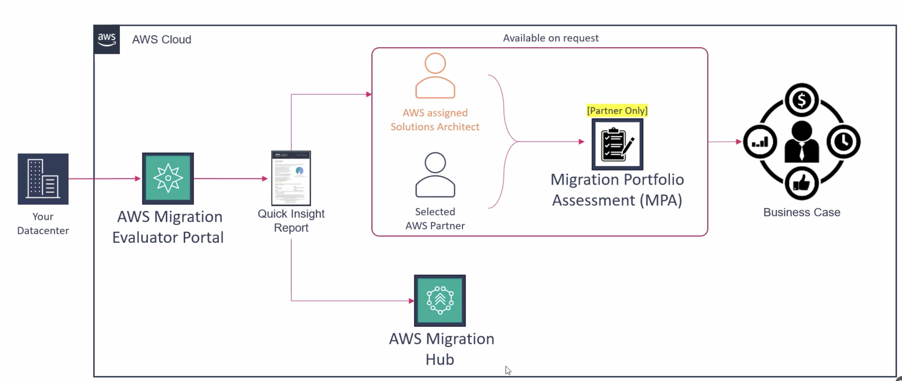

# Migration Evaluator Tool

Understanding your current IT environment is a key step when planning a move to the cloud. The **Migration Evaluator tool** is designed to help with this.

This tool was previously known by another name, **TSO Logic**, and was acquired. Many of its concepts, the user interface, and how you access it remain similar.

## What it Does

Migration Evaluator helps simplify the analysis of your on-premise infrastructure. It focuses on understanding details about your:

*   Compute resources (servers)
*   Local storage
*   Memory
*   Microsoft licenses

It helps you avoid manually checking every detail, which would take too much time.

## How to Access

This tool is **not accessed through the regular AWS console**. You need to go to a specific web address, console.tso logic.com.

You likely **will not have immediate access** unless you are a specific team member or partner. You may need to **ask support or a migration team to help you get access**. They can set up what is called an 'engagement' for you, which is like your dedicated evaluation space.

Once an engagement is created and shared with you, you can add details about your on-premise resources or upload information.

## How it Works (Data Collection)

Migration Evaluator needs data about your environment to provide insights. There are a couple of ways to get this data into the tool:

*   **Using the Collector Software**: You can download software from the tool's section within the web portal. This software is installed on a **Windows server** in your data center. The installation guide provides details on requirements and setup. Once installed, this collector software will set up a small local database on that Windows server and start collecting data from your other servers (like those on VMware, Hyper-V, or bare metal, and SQL servers). This collection is **agentless**, meaning you do not need to install anything directly on the servers you are collecting data *from*. The collector on the Windows machine gathers the information remotely. It collects data on compute, memory, local storage, operating system, and Microsoft licenses.

*   **Using Self-Reported Files**: If you already have a Configuration Management Database (CMDB) or other sources with up-to-date details about your data center or applications, you can export this data into flat files (like CSV or zip). These files can then be **imported directly into the Migration Evaluator portal** as self-reported files. Templates are available to help with formatting if needed.

The collected data is initially **stored locally** on the Windows server where the collector is installed.

## Data Export and Reports

You have the **option** to upload the collected data from the local collector to an Amazon S3 bucket of your choice. This auto-sync feature is optional because some users might have concerns about exporting data due to legal or security reasons. If you choose not to auto-sync, the data stays local.

From the Migration Evaluator web portal, you can then analyze the data or generate reports.

The primary output is a **Quick Insight report**. This report can take some time to generate. If you use the auto-sync feature, the report might be created automatically. If you manually upload files or do not auto-sync, you may need to contact a migration team to help generate it.

The Quick Insight report can be downloaded as a PDF. You can also download the collected data in a standard format. This standard export can be customized locally (for example, to remove server names or IP addresses) before potentially being pushed elsewhere or used with other tools.

## Using the Output

Once the Quick Insight report is ready, the data can be used for further analysis.

*   You can use this report to **engage a Solution Architect or a selected partner**. They can help analyze the data and potentially feed it into **another tool called Migration Portfolio Assessment (MPA)**. MPA is typically a partner-only tool. Using Migration Evaluator's output with MPA can lead to the creation of a business case, showing the cost comparison between on-premise ownership and running on AWS, including licensing considerations.
*   If you have the expertise, you can also bring the report data into the **AWS Migration Hub** for analysis and operations on your own.

In summary, Migration Evaluator helps you collect detailed inventory and utilization data from your on-premise environment in an automated way, supporting the creation of a business case for migration. It requires initial engagement to get access, but data collection can become self-service.
