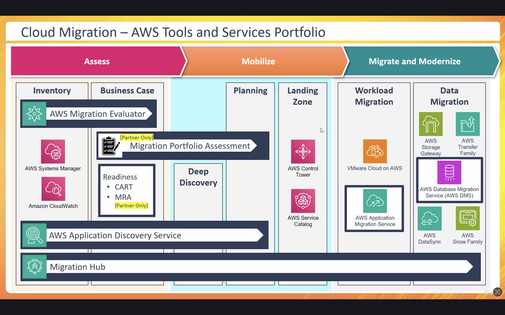

# AWS Cloud Migration - MAP (Migration Acceleration Program)

This repository provides an overview of AWS Cloud Migration phases and tools, especially focusing on the AWS Migration Acceleration Program (MAP). The concepts are explained by drawing an analogy between people migration and cloud migration.

## Migration Phases

Cloud migration can be broadly divided into three phases:

- **Assess** (also called Mobilize): Understand your existing environment, build a business case, and get ready to migrate.
- **Migrate**: Execute the actual migration of workloads and data to the cloud.
- **Modernize**: Optimize and evolve applications and infrastructure after migration.

## People Migration Analogy

Migration can be compared to people moving between countries. Like individuals rely on consultancies or companies to help with immigration, AWS MAP provides guidance, funding, and tools for cloud migration.

## AWS MAP (Migration Acceleration Program)

MAP helps enterprises move to AWS using best practices, tools, training, and funding support. It offers:

- Proven methodologies
- Partner and consultancy support
- Funding and investment credits
- Tools and workshops for training and readiness

  

## Key Services and Tools

- **Migration Evaluator**: Helps assess current workloads and build a business case.
- **AWS Systems Manager & CloudWatch**: Collect inventory and monitor on-prem resources.
- **Application Discovery Service**: Gathers detailed data for planning.
- **Cloud Adoption Readiness Tool (CART)**: Assesses organizational readiness for cloud.
- **Migration Portfolio Assessment (MPA)**: A partner-only tool for detailed assessment.
- **AWS Control Tower & Service Catalog**: Set up landing zones following AWS best practices.
- **Application Migration Service**: Migrates servers and workloads.
- **AWS Database Migration Service (DMS)**: Migrates databases to AWS.
- **AWS DataSync, Snow Family, Storage Gateway**: Tools for transferring data and building hybrid environments.
- **AWS Migration Hub**: Central tool to track and manage all migration activities.

## Additional Notes

- Tool selection depends on use case, technical expertise, and partner availability.
- AWS Marketplace provides many third-party tools to support specific migration needs.
- People migration is more than technology—organizational change is equally important.
- Migration Hub helps consolidate all activities and progress tracking in one place.

## Goal

This project aims to provide a hands-on understanding of AWS cloud migration with MAP and familiarize users with essential tools and services required for successful enterprise migration.

